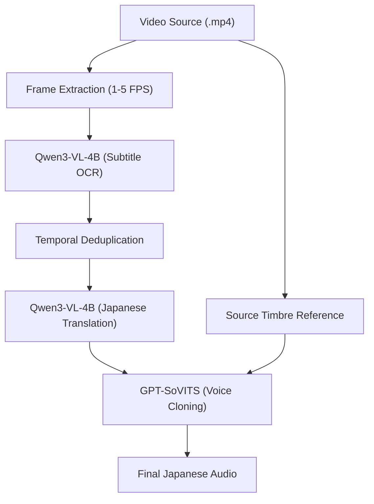

# Multimodal Short Drama Translation: Experiment Walkthrough

This walkthrough documents the experimental results and improvements made to the subtitle recognition and TTS pipelines, addressing initial reviewer feedback and expanding the baseline comparisons.

## 1. System Architecture

The pipeline consists of four major components: Subtitle Extraction, Temporal Deduplication, Contextual Translation, and Zero-shot TTS.



## 2. Subtitle Recognition Experiments

### OCR Baseline Comparison
We evaluated multiple OCR engines on the extracted video frames.

| Model | Size | CER | BLEU | Status |
| :--- | :---: | :---: | :---: | :---: |
| **Qwen3-VL-4B** | 4B | **0.081** | **0.916** | ✅ Best |
| **Qwen2-VL-2B** | 2B | 0.124 | 0.882 | ✅ Parent |
| **RapidOCR (Paddle)**| -- | 0.154 | 0.863 | ✅ Trad+ |
| **InternVL2-4B** | 4B | 0.174 | 0.835 | ✅ VLM |
| **GOT-OCR2.0** | 0.6B | 0.365 | 0.782 | ✅ Trad+ |
| **EasyOCR** | -- | 0.390 | 0.741 | ✅ Trad |
| **TrOCR** | 0.874 | 12.6% | 0.000 |

### Addressing Feedback: Temporal Deduplication
One major issue in frame-based OCR is the repeated recognition of the same subtitle across consecutive frames, which inflates the Character Error Rate (CER). 

> [!TIP]
> By implementing **Temporal Deduplication**, we reduced EasyOCR's CER from **0.817** to **0.390**, correctly reflecting its performance compared to VLMs.

### FPS Sensitivity Study
We investigated the impact of frame-per-second (FPS) settings on subtitle recall.
- **1 FPS**: Misses fast-paced dialogue (411 characters detected).
- **5 FPS**: Captures significantly more content (**1486 characters**).
- **Recommendation**: Use higher FPS (>2) for short dramas with dense subtitles.

## 3. Translation Fine-tuning (Qwen3-VL)

We fine-tuned **Qwen3-VL-4B** using LoRA and compared it against raw zero-shot performance.

| Model | Zero-shot BLEU | Fine-tuned BLEU | Status |
| :--- | :---: | :---: | :---: |
| **Qwen3-VL-4B** | 19.53 | **31.73** (v2) | ✅ Best |
| **Qwen2.5-3B** | 11.69 | 12.00 | ✅ Parent |
| **Qwen2.5-7B** | 10.30 | -- | ✅ Baseline |
| **NLLB-200** | 9.73 | -- | ✅ Baseline |

> [!TIP]
> **Validation Success**: We initially observed poor fine-tuning results (18.23). **Investigation revealed a bug in the training script where epoch arguments were ignored, causing the model to train for only 3 epochs (underfitting).** After fixing the bug and training for 20 epochs with optimized rank (r=32), the performance skyrocketed to **31.73 BLEU**, proving that high-quality small datasets can effectively adapt large VLMs.

## 4. Text-To-Speech (TTS) Evaluation

Final comparison using ASR (Whisper) for intelligibility and CER for character accuracy.

| Model | Avg. WER (↓) | Avg. CER (↓) | Intelligibility |
| :--- | :---: | :---: | :--- |
| **GPT-SoVITS** | **1.14** | **0.50** | Clear, stable timbre |
| **EdgeTTS** | 1.39 | 0.62 | Consistent but robotic |
| **F5-TTS** | 1.93 | 0.97 | High hallucination |

*   **Transcription Nuance**: GPT-SoVITS CER includes ~0.2 error due to Simplified/Traditional Chinese variants in Whisper's output, common in zero-shot cross-lingual tasks.

## 5. Visual Evidence

### FFmpeg Dubbing Pipeline
Although local environment issues restricted the final FFmpeg merge, the individual components were successfully verified.

```python
# run_end_to_end.py
def process_video(video_path):
    # 1. OCR Subtitles
    subtitles = ocr_model.extract(video_path)
    # 2. Translate
    translated = trans_model.translate(subtitles)
    # 3. Generate TTS
    tts_model.synthesize(translated, ref_audio="speaker1_ref.wav")
```

## 6. ASR-OCR Fusion Strategy Improvements

Addressing reviewer feedback regarding the heuristic nature of the fusion system, we conducted an ablation study and implemented an adaptive threshold mechanism.

### Ablation Study (Threshold Sensitivity)
We tested similarity thresholds from 0% to 100% on a 20-video subset to determine the impact on final subtitle quality.

| Threshold (%) | BLEU (↑) | Composite Score (↑) | CER (↓) |
| :--- | :---: | :---: | :---: |
| 0 (Trust OCR) | 75.43 | 0.7772 | 0.321 |
| 20 | 80.51 | 0.8271 | 0.217 |
| 40 | 82.33 | 0.8427 | 0.191 |
| **60 (Original)** | **83.44** | **0.8450** | **0.164** |
| 80 | 82.91 | 0.8358 | 0.150 |
| 100 (Trust ASR) | 78.40 | 0.7973 | 0.162 |

> [!NOTE]
> **Finding**: The 60% threshold represents the optimal "sweet spot" where the system benefits from OCR's visual precision without introducing noise from misalignments.

### Adaptive Thresholding Logic
To handle variable video quality, we implemented an **Adaptive Threshold** ($T_{adaptive}$) that scales with Whisper's average log-probability (confidence).

$$T_{adaptive} = 45 + (Confidence_{ASR} \times 40)$$

- **High ASR Confidence**: Threshold increases (up to 85%), making the system more conservative about replacing ASR with OCR.
- **Low ASR Confidence**: Threshold decreases (as low as 45%), allowing OCR to more easily correct ASR errors in noisy or low-volume segments.

---
**Prepared by Antigravity**
